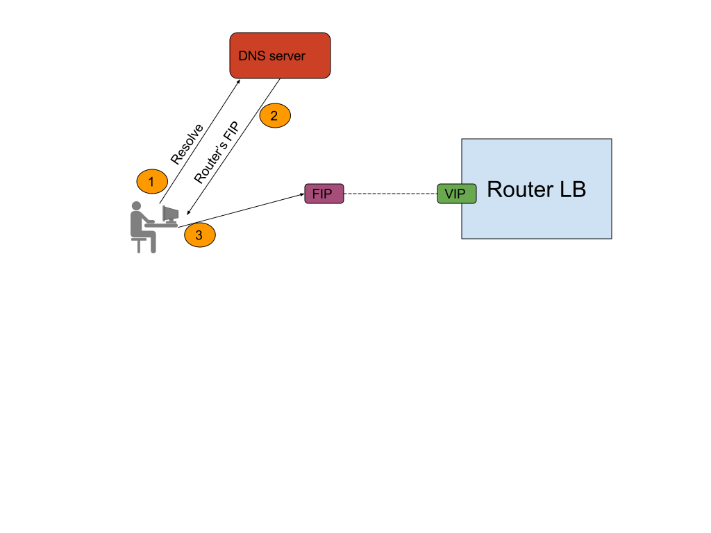
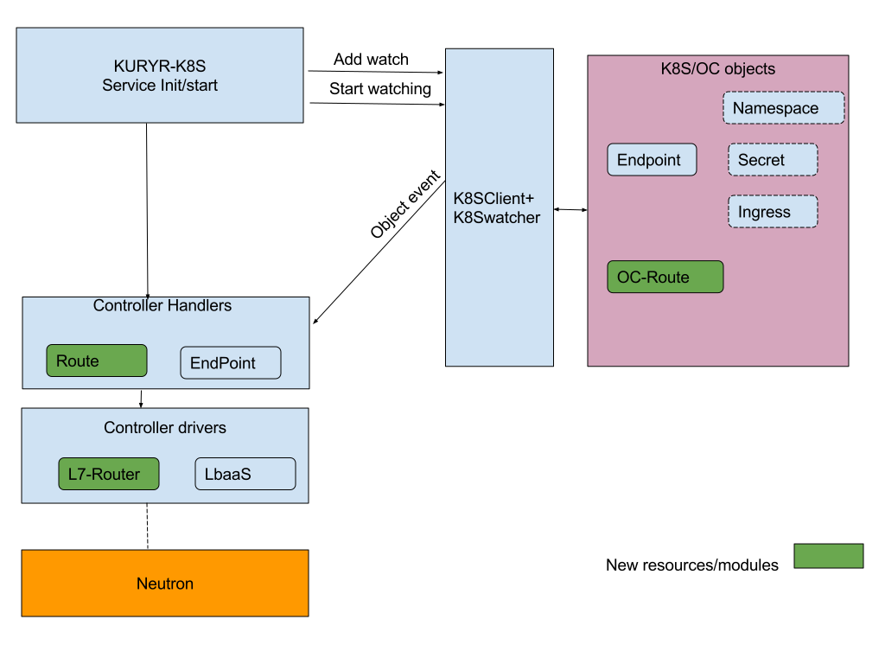
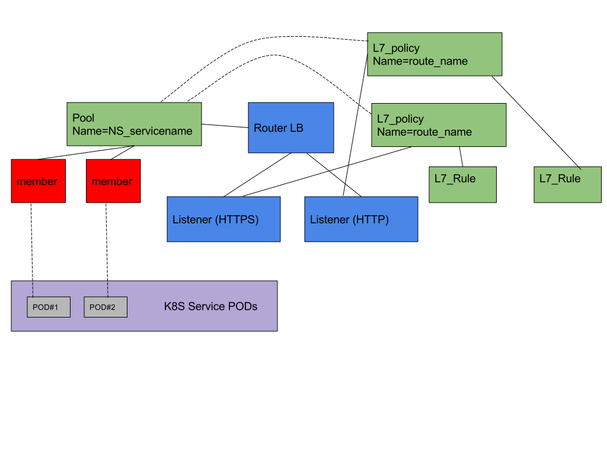

..
    This work is licensed under a Creative Commons Attribution 3.0 Unported
    License.

    http://creativecommons.org/licenses/by/3.0/legalcode

    Convention for heading levels in Neutron devref:
    =======  Heading 0 (reserved for the title in a document)
    -------  Heading 1
    ~~~~~~~  Heading 2
    +++++++  Heading 3
    '''''''  Heading 4
    (Avoid deeper levels because they do not render well.)

=========================================================
Kuryr Kubernetes ocp-route And Ingress Integration Design
=========================================================

Purpose
-------
The purpose of this document is to present how openshift route and Kubernetes ingress are supported
by the kuryr integration.

Overview
----------
An OpenShift route [1]_ and Kubernetes ingress [2]_ are used to give services externally-reachable URLs,
load balance traffic, terminate SSL, offer name based virtual hosting, and more.
Each route/ingress consists of a name, service identifier, and (optionally) security configuration.
A defined route/ingress and the endpoints identified by its service are consumed by a L7-router
to provide named connectivity that allows external clients to reach your applications.

Proposed Solution
-----------------
An OpenShift/Kubernetes administrator can deploy L7 router in an OpenShift/Kubernetes cluster,
which enable ingress/ocp-routes created by developers to be used by external clients.
The Router should perform L7 routing layer based on L7 rules database, where the ingress/ocp-route
and endpoints controllers are responsible for updating the L7 rules database.
Kuryr will use neutron LbaaS L7 policy capability [3]_ to perform this task.

Controller Handlers and Drivers impact:
---------------------------------------
The controller part will be composed of the following :
1. L7 Router manager
2. Ingress/ocp-route controllers.
3. Endpoint controller

The L7 Router manager
~~~~~~~~~~~~~~~~~~~~~~~~~~
The L7 router manager is responsible for create/get L7 routers,
A L7 router is the entity that responsible to perform the actual L7 routing/URL mapping,
based on rules database.
When an HTTP/HTTPS packet hits the L7 router, the L7 router uses its rules databse
to determine the destination (based on the fields content in HTTP header,e.g: HOST_NAME, PATH).

In Kuryr context, the L7 router is actually an externally reachable loadbalancer; for achieving external connectivity
a floating IP (allocated from 'external_svc_subnet') is bounded to the Router loadbalancer.
The following parameters should be configured in kuryr.conf file to enable L7 Router::

         [neutron_defaults]
         external_svc_subnet=external_subnet_id
         [kubernetes]
         l7_router_driver= neutron_l7_policy

After the L7 router was created, we should retrieve the Router's FIP,
and point (at DNS) external traffic to L7 Router(FIP).
The Router's FIP could be retrieved from node annotation's as appears below.

.. code-block:: yaml

    metadata:
      annotations:
        openstack.org/kuryr-l7-router-state: '{"versioned_object.data": {"fip": "172.24.4.14",
        "router_lb": {"versioned_object.data": {"id": "90732f0a-651a-4b17-a14e-9b0e01fbe774",
        "ip": "10.0.0.154", "name": "kuryr-l7-router", "port_id": "5c71a29a-0dc1-461e-81ee-2258a7e3842d",
        "project_id": "868307936d384c21824e5eb0425a3f42", "subnet_id": "9f6d8c9f-d22d-480e-80f5-867daa050ff8"},
        "versioned_object.name": "LBaaSLoadBalancer", "versioned_object.namespace":
        "kuryr_kubernetes", "versioned_object.version": "1.0"}}, "versioned_object.name":
        "L7RouterState", "versioned_object.namespace": "kuryr_kubernetes", "versioned_object.version":
        "1.0"}'volumes.kubernetes.io/controller-managed-attach-detach: "true"
        creationTimestamp: 2017-11-17T19:52:54Z

The next diagram illustrates data flow from external user to L7 loadbalancer:

Ingress/OCP-Route controllers
~~~~~~~~~~~~~~~~~~~~~~~~~~~~~
The ingress/ocp-route controller watches the apiserver's for updates to
the Ingress/ocp-route. Its job is to satisfy requests for Ingresses/ocp-route.
The following scheme describe ingress/ocp-route controller SW architecture:

Each Ingress/ocp-route being translated to a L7 policy in
L7 router, and the rules on the Ingress/ocp-route become L7 (URL)
mapping rules in that L7 policy.
The L7 policy is configured to forward the filtered traffic to LbaaS Pool.
The LbaaS pool represents an Endpoint resource, and it's the Endpoint controller responsibility
to attach all Endpoint's members to this pool.
Since the Endpoint resource is not aware to changes in ingress/ocp-route objects pointing to it, the ingress/ocp-route
controller should trigger this notification, the notification will e implemented using annotation.

Endpoint controller
~~~~~~~~~~~~~~~~~~~~~
The Endpoint controller should be extended to support the flows involving
route/ingress resources.
The Endpoint controller should add/delete all it's members to the LbaaS pool mentioned above, in case
a route/ingress is pointing this Endpoint as it's destination.

The L7 router driver
~~~~~~~~~~~~~~~~~~~~~
The L7 router manager, ingress/ocp-route controllers and endpoint controller will call the L7 router driver services
to create the L7 routing entities chain.
The L7 router will rely on neutron LbaaS functionality.

**Note:** Neutron LbaaS L7 functions are implemented *only* for the OCTAVIA provider, in case L7 routing is required
the Neutron LbaaS provider must be configured to be OCTAVIA.

A diagram describing L7 router entities is given below:

Use cases examples
~~~~~~~~~~~~~~~~~~
This section describes the detailed flow of the following scenarios:

  A. Create service/endpoint with no ocp-route/ingress pointing to it.
  B. Create service/endpoint, ocp-route, delete ocp-route.

* Need to do some sync operation to make-sure Neutron topology is synchronised
  with Kubernetes Network Policy model.

  * for every network-policy, for each pod selector in the policy:

    * get from kubernetes-api all pods that selected by this query.

    * get all ports of the relevant security-groups.

    * Do diff between port that needed to be attached to SG,
      and add/remove pod-ports from security-groups.

* Create service/endpoint with no ocp-route/ingress pointing to it.

  * Service/Endpoint is created
  
    * name: s1
    
    * the Service and Endpoint controllers will create user loadbalancer

* Create service/endpoint, ocp-route/ingress, delete ocp-route/ingress:

  * Service/Endpoint is created
  
    * name: s1
    
    * the Service and Endpoint controllers will create user loadbalancer
    
  * ocp-route is created
  
    * ocp-route details :

.. code-block:: yaml

    apiVersion: v1
    kind: Route
    metadata:
      name: test
    spec:
      host: www.example.com
      to:
        kind: Service
        name: s1

    * Since it's the first route pointing to this service, the ocp controller will
      create LbaaS pool (attached to L7 router)- let's call it s1_pool.
      
    * The ocp-route controller will create L7 rule and L7 policy, the L7 policy should direct it's filtered traffic
       towards s1_pool.
       
    * The last step from ocp-controller will be to notify (using annotation) s1 endpoint.
    
    * As a result to the ocp-route notification, the endpoint handler will be called.
      The endpoint handler will update members information attached to s1_pool and clear notification
      (by deleting the annotation).
      
  * ocp-route is deleted
  
    * ocp-route controller will first delete L7 rule and L7 policy.
    
    * In case no other L7 policy is pointing s1_pool, the ocp-controller will delete s1_pool and notify s1 endpoint
       that no ocp-route is pointing to it.
       
    * As a result to the ocp-route notification, the endpoint handler will 'clean' all the resources he allocated
      to serve this routes.

References
==========
.. [1] https://docs.openshift.com/enterprise/3.0/architecture/core_concepts/routes.html
.. [2] https://kubernetes.io/docs/concepts/services-networking/ingress/#what-is-ingress
.. [3] https://wiki.openstack.org/wiki/Neutron/LBaaS/l7
