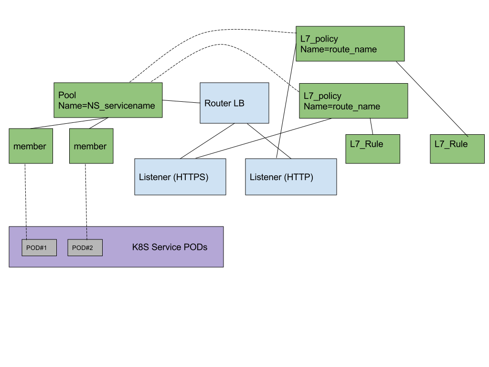

..
    This work is licensed under a Creative Commons Attribution 3.0 Unported
    License.

    http://creativecommons.org/licenses/by/3.0/legalcode

    Convention for heading levels in Neutron devref:
    =======  Heading 0 (reserved for the title in a document)
    -------  Heading 1
    ~~~~~~~  Heading 2
    +++++++  Heading 3
    '''''''  Heading 4
    (Avoid deeper levels because they do not render well.)

=========================================================
Kuryr Kubernetes ocp-route And Ingress Integration Design
=========================================================

Purpose
-------
The purpose of this document is to present how openshift route and Kubernetes ingress are supported
by the kuryr integration.

Overview
----------
An OpenShift route and Kubernetes ingress are used to give services externally-reachable URLs,
load balance traffic, terminate SSL, offer name based virtual hosting, and more.
Each route/ingress consists of a name, service identifier, and (optionally) security configuration.
A defined route/ingress and the endpoints identified by its service are consumed by a L7-router 
to provide named connectivity that allows external clients to reach your applications.

Proposed Solution
-----------------
An OpenShift/Kubernetes administrator can deploy L7 router in an OpenShift/Kubernetes cluster,
which enable ingress/ocp-routes created by developers to be used by external clients.
The Router should perfrom L7 routing layer based on L7 rules database, where the Ingress/OCP-Route
controllers are responsible for updating the L7 rules database.
The layer 7 loadbalacing capability will be composed from :
1. L7 Router
2. Ingress/OCP-Route controllers.

The L7 Router
~~~~~~~~~~~~~
The L7 Router is based on neutron LbaaS L7 policy capability,
L7 router is an extranlly reachable loadbalancer, for achieving external conenctivity
a floating IP (allocated from 'external_svc_subnet') is bounded to the Router loadbalancer.
The following parameters should be configured in kuryr.conf file to enable L7 Router::

         [neutron_defaults]
         external_svc_subnet=  external_subnet_id
         [kubernetes]
         l7_router_driver= neutron_l7_policy 
         
After the L7 router was created, we should retrieve the Router's FIP, 
and point (at DNS) external traffic to L7 Router(FIP).
The Router's FIP could be retrieved from node annotation's as appears below.
.. code-block:: yaml

    apiVersion: v1
    kind: Node
    metadata:
      annotations:
        openstack.org/kuryr-l7-router-state: '{"versioned_object.data": {"fip": "172.24.4.14",
          "router_lb": {"versioned_object.data": {"id": "90732f0a-651a-4b17-a14e-9b0e01fbe774",
          "ip": "10.0.0.154", "name": "kuryr-l7-router", "port_id": "5c71a29a-0dc1-461e-81ee-2258a7e3842d",
          "project_id": "868307936d384c21824e5eb0425a3f42", "subnet_id": "9f6d8c9f-d22d-480e-80f5-867daa050ff8"},
          "versioned_object.name": "LBaaSLoadBalancer", "versioned_object.namespace":
          "kuryr_kubernetes", "versioned_object.version": "1.0"}}, "versioned_object.name":
          "L7RouterState", "versioned_object.namespace": "kuryr_kubernetes", "versioned_object.version":
          "1.0"}'
        volumes.kubernetes.io/controller-managed-attach-detach: "true"
      creationTimestamp: 2017-11-17T19:52:54Z

The next diagram illustrates data flow from external user to L7 loadbalancer:

.. image:: ../../images/external_traffic_to_l7_router.svg
    :alt: external traffic to L7 loadbalancer
    :align: center
    :width: 100%

Ingress/OCP-Route controllers
~~~~~~~~~~~~~~~~~~~~~~~~~~~~~
The ingress/ocp-route controller watches the apiserver's for updates to
the Ingress/ocp-route and Endpoint resources. Its job is to satisfy requests
for Ingresses/ocp-route.
The following scheme describe ingress/ocp-route controller SW architecture:

.. image:: ../../images/kuryr_k8s_route_ctrl_sw.svg
    :alt: Ingress/OCP-Route controllers SW architecture
    :align: center
    :width: 100%

Each Ingress/ocp-route being translated to a L7 policy in
L7 router, and the rules on the Ingress/ocp-route become L7 (URL)
mapping rules in that L7 policy.
The L7 policy is configured to forward the filtered traffic to LbaaS Pool,
This pool is pointing to all members of the specified kuberenets Endpoint.

A diagram describing L7 routing entities is given below:

