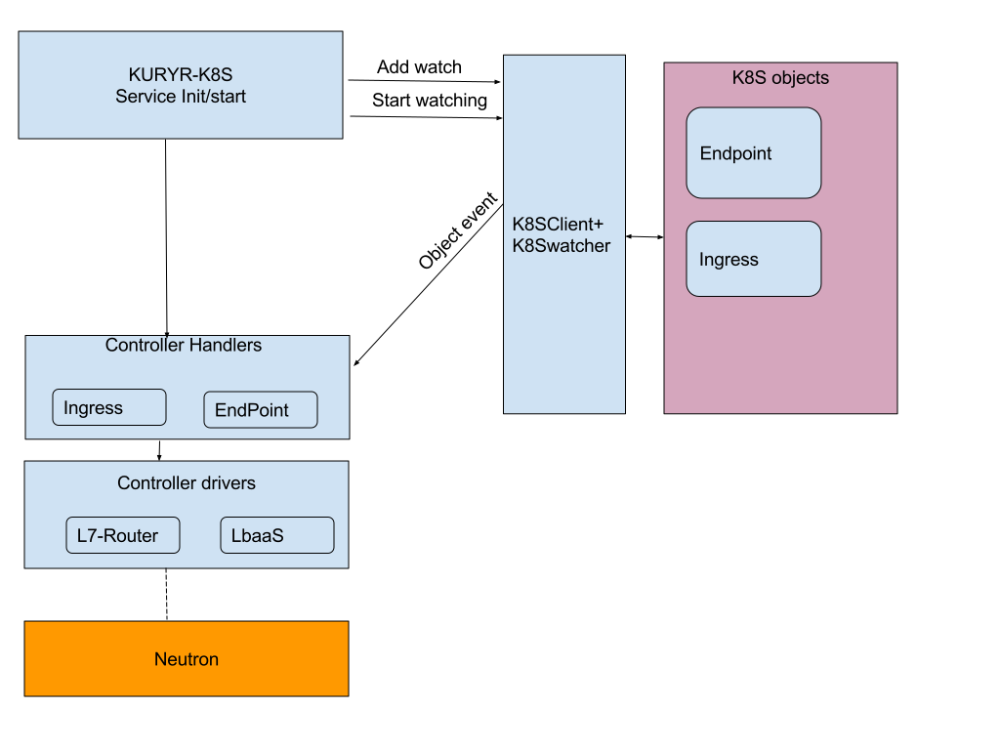

..
    This work is licensed under a Creative Commons Attribution 3.0 Unported
    License.

    http://creativecommons.org/licenses/by/3.0/legalcode

    Convention for heading levels in Neutron devref:
    =======  Heading 0 (reserved for the title in a document)
    -------  Heading 1
    ~~~~~~~  Heading 2
    +++++++  Heading 3
    '''''''  Heading 4
    (Avoid deeper levels because they do not render well.)

=========================================================
Kuryr Kubernetes ingress integration design
=========================================================

Purpose
-------
The purpose of this document is to present how Kubernetes ingress is supported
by the kuryr integration.

Overview
----------
A Kubernetes ingress [2]_ are used to give services externally-reachable URLs,
load balance traffic, terminate SSL, offer name based virtual hosting, and more.
Each ingress consists of a name, service identifier, and (optionally) security configuration.
A defined ingress and the endpoints identified by its service are consumed by a L7-router
to provide named connectivity that allows external clients to reach your applications.

Proposed Solution
-----------------
A Kubernetes administrator can deploy L7 router in an Kubernetes cluster,
which enable ingress resources created by developers to be used by external clients.
The Router should perform L7 routing based on L7 rules database, where the ingress
and endpoints controllers are responsible for updating the L7 rules database.
Kuryr will use neutron LbaaS L7 policy capability [3]_ to perform this task.

Controller Handlers and Drivers impact:
---------------------------------------
The controller part will be composed of the following :

1. L7 Router manager
2. Ingress controller.
3. Endpoint controller

The L7 Router manager
~~~~~~~~~~~~~~~~~~~~~~~~~~
The L7 router manager is responsible for create/get L7 routers,
A L7 router is the entity that responsible to perform the actual L7 routing/URL mapping,
based on the rules database.
When an HTTP/HTTPS packet hits the L7 router, the L7 router uses its rules databse
to determine the endpoint destination (based on the fields content in HTTP header,e.g: HOST_NAME, PATH).

In Kuryr context, the L7 router is actually an externally reachable loadbalancer; for achieving external connectivity
a floating IP (allocated from 'external_svc_subnet') is bounded to the Router loadbalancer.
The following parameters should be configured in kuryr.conf file to enable L7 Router::

         [neutron_defaults]
         external_svc_subnet=external_subnet_id
         [kubernetes]
         l7_router_driver= neutron_l7_policy

After the L7 router was created, we should retrieve the Router's FIP,
and point (at DNS) external traffic to L7 Router(FIP).
The Router's FIP could be retrieved from node annotation's as appears below.

.. code-block:: yaml

    metadata:
      annotations:
        openstack.org/kuryr-l7-router-state: '{"versioned_object.data": {"fip": "172.24.4.14",
        "router_lb": {"versioned_object.data": {"id": "90732f0a-651a-4b17-a14e-9b0e01fbe774",
        "ip": "10.0.0.154", "name": "kuryr-l7-router", "port_id": "5c71a29a-0dc1-461e-81ee-2258a7e3842d",
        "project_id": "868307936d384c21824e5eb0425a3f42", "subnet_id": "9f6d8c9f-d22d-480e-80f5-867daa050ff8"},
        "versioned_object.name": "LBaaSLoadBalancer", "versioned_object.namespace":
        "kuryr_kubernetes", "versioned_object.version": "1.0"}}, "versioned_object.name":
        "L7RouterState", "versioned_object.namespace": "kuryr_kubernetes", "versioned_object.version":
        "1.0"}'volumes.kubernetes.io/controller-managed-attach-detach: "true"
        creationTimestamp: 2017-11-17T19:52:54Z

The next diagram illustrates data flow from external user to L7 loadbalancer:

.. image:: ../../images/external_traffic_to_l7_router.svg
    :alt: external traffic to L7 loadbalancer
    :align: center
    :width: 100%

Ingress controller
~~~~~~~~~~~~~~~~~~~~~~~~~~~~~
The ingress controller watches the apiserver's for updates to
the Ingress. Its job is to satisfy requests for Ingresses.
The following scheme describe ingress controller SW architecture:

Each ingress being translated to a L7 policy in
L7 router, and the rules on the Ingress become L7 (URL)
mapping rules in that L7 policy.
The L7 policy is configured to forward the filtered traffic to LbaaS Pool.
The LbaaS pool represents an Endpoint resource, and it's the Endpoint controller responsibility
to attach all the Endpoint's members to this pool.
Since the Endpoint resource is not aware to changes in ingress objects pointing to it, the ingress
controller should trigger this notification, the notification will e implemented using annotation.

Endpoint controller
~~~~~~~~~~~~~~~~~~~~~
The Endpoint controller should be extended to support the flows involving
route/ingress resources.
The Endpoint controller should add/delete all its members to/from the LbaaS pool mentioned above, in case
a route/ingress is pointing this Endpoint as it's destination.

The L7 router driver
~~~~~~~~~~~~~~~~~~~~~
The L7 router manager, ingress controller and endpoint controller will call the L7 router driver services
to create the L7 routing entities chain.
The L7 router driver will rely on neutron LbaaS functionality.

**Note:** Neutron LbaaS L7 functions are implemented *only* for the OCTAVIA provider, in case L7 routing is required
the Neutron LbaaS provider must be configured to be OCTAVIA.

A diagram describing L7 router driver entities is given below:

.. image:: ../../images/l7_routing_neutron_entities.svg
    :alt: L7 routing entities
    :align: center
    :width: 100%    
- The blue components are created/released by the L7 router manager.
- The green components are created/released by ingress controller.
- The red components are created/released by endpoint controller.

Use cases examples
~~~~~~~~~~~~~~~~~~
This section describes the detailed flow of the following scenarios:

  A. Create ingress, create service/endpoint.
  B. Create service/endpoint, create ingress, delete ingress.

* Create ingress, create service/endpoint:

  * ingress is created under namespace 'mynamespace'
  
    * ingress details :

    .. code-block:: yaml

        apiVersion: extensions/v1beta1
        kind: Ingress
        metadata:
        name: test
        spec:
        rules:
        - host: www.example.com
            http:
            paths:
            - backend:
                serviceName: s1
                servicePort: 80
        
    * Since it's the first route pointing to this service, the ingress controller will
      create LbaaS pool (attached to L7 router)- named 'mynamespace_s1'.
      
    * The ingress controller will create L7 rule and L7 policy, the L7 policy direct it's filtered traffic towards s1_pool.
      
  * Service/Endpoint is created under namespace 'mynamespace'
  
    * name: s1
    
    * The Service and Endpoint controllers will create user loadbalancer
      
    * The Endpoint controller will check for pool named 'mynamespace_s1' and add its members to this pool.
    
* Create service/endpoint, create ingress, delete ingress:

  * Service/Endpoint is created under namespace 'mynamespace'
  
    * name: s1
    
    * The Service and Endpoint controllers will create user loadbalancer
    * Since no pool named 'mynamespace_s1' exist in L7 router, service will exit.
       
  * Ingress is created with same details as described in above yaml file.
  
    * Since it's the first route pointing to this service, the ingress controller will
      create LbaaS pool (attached to L7 router) named 'mynamespace_s1'.      
    * The ingress controller will create L7 rule and L7 policy, the L7 policy configured to direct its filtered traffic towards 'mynamespace_s1' pool.
       
    * The last step from ingress controller will be to notify (using annotation) s1 endpoint.
    
    * As a result to the ingress notification, the endpoint handler will be called.
      The endpoint handler will update the members information attached to 'mynamespace_s1' pool and clear notification
      (by deleting the annotation).
      
  * Ingress is deleted
  
    * Ingress controller will first delete L7 rule and L7 policy.
  
    * In case no other L7 policy is pointing 'mynamespace_s1', the ingress controller will delete 'mynamespace_s1' pool and notify s1 endpoint that no ingress is pointing to it.
               
    * As a result to the ingress controller notification, the endpoint handler will 'clean' all the resources he allocated
      to serve this route.

References
==========
.. [1] https://docs.openshift.com/enterprise/3.0/architecture/core_concepts/routes.html
.. [2] https://kubernetes.io/docs/concepts/services-networking/ingress/#what-is-ingress
.. [3] https://wiki.openstack.org/wiki/Neutron/LBaaS/l7
